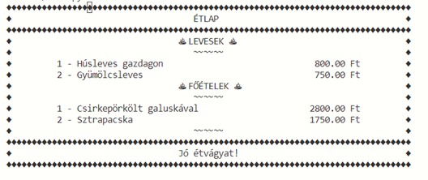
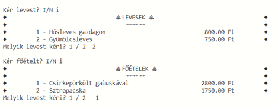
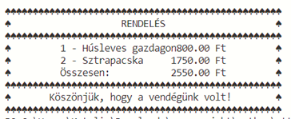

# Étterem projekt

Eljárások hívásának gyakorlására, paraméterátadás
Fontos feladat a projekt előzetes tervezése, és a csapatmunka/pármunka koordinálása.

## A projekt moduljai
1.	Étlap modul – feladata az étlap megjelenítése
2.	Rendelésfelvétel modul – feladata  a rendelések rögzítése
3.	Számla modul – a fizetendő tételek és összegek kiírása

## Étlap modul

## Rendelésfelvétel modul

## Rendelés összegzése modul

